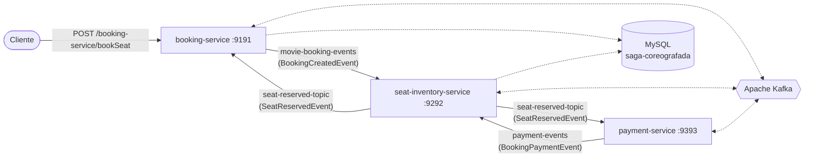

# 🎬 Saga Coreografada — Sistema de Reserva de Ingressos de Cinema

Projeto de estudo que implementa o padrão **Saga Coreografada (Choreographed Saga)** para gerenciar uma transação distribuída de reserva de ingressos de cinema, usando **Spring Boot**, **Apache Kafka** e **MySQL**.

Não existe um orquestrador central: cada microsserviço reage a eventos publicados por outro serviço e, em seguida, publica seus próprios eventos — inclusive eventos de **compensação** quando algo falha (ex.: pagamento recusado ou assento indisponível).

## 📖 Índice

- [Arquitetura](#-arquitetura)
- [Módulos do projeto](#-módulos-do-projeto)
- [Fluxo da saga](#-fluxo-da-saga)
- [Tópicos Kafka](#-tópicos-kafka)
- [Stack tecnológica](#-stack-tecnológica)
- [Estrutura de pastas](#-estrutura-de-pastas)
- [Pré-requisitos](#-pré-requisitos)
- [Como executar](#-como-executar)
- [API — Endpoints](#-api--endpoints)
- [Cenários de teste](#-cenários-de-teste)
- [Observações e limitações conhecidas](#-observações-e-limitações-conhecidas)

## 🏗️ Arquitetura



Cada serviço só conhece os eventos que consome e produz — não há chamadas síncronas (REST) entre `booking-service`, `seat-inventory-service` e `payment-service`. Toda a coordenação acontece de forma assíncrona via **Apache Kafka**.

## 📦 Módulos do projeto

| Módulo | Tipo | Porta | Responsabilidade |
|---|---|---|---|
| `movie-booking-commons` | Biblioteca compartilhada | — | DTOs de request/response, eventos de domínio e constantes de tópicos/grupos Kafka usados por todos os serviços |
| `booking-service` | Microsserviço (Spring Boot) | `9191` | Ponto de entrada da saga: recebe o pedido de reserva, persiste a *booking* e inicia o fluxo publicando `BookingCreatedEvent` |
| `seat-inventory-service` | Microsserviço (Spring Boot) | `9292` | Controla o inventário de assentos: trava (`LOCKED`) ou libera assentos conforme o andamento da saga |
| `payment-service` | Microsserviço (Spring Boot) | `9393` | Simula o processamento de pagamento (serviço *stateless*, sem banco de dados) |

O `movie-booking-commons` precisa ser instalado no repositório Maven local (`mvn install`) antes de compilar os demais serviços, pois eles dependem dele via `groupId: br.com
pedrosa`.

## 🔄 Fluxo da saga

**Caminho feliz (happy path):**

1. O cliente chama `POST /booking-service/bookSeat` no `booking-service`.
2. `booking-service` salva a reserva (status inicial `CONFIRMED`) e publica `BookingCreatedEvent` no tópico `movie-booking-events`.
3. `seat-inventory-service` consome o evento, verifica se todos os assentos pedidos estão `AVAILABLE`; se sim, marca-os como `LOCKED` e publica `SeatReservedEvent(reserved=true)` no tópico `seat-reserved-topic`.
4. Esse evento é consumido por **dois** serviços em paralelo:
    - `booking-service`: apenas registra em log que a reserva foi concluída.
    - `payment-service`: processa o pagamento. Se `amount > 2000`, o pagamento é recusado; caso contrário, é aprovado. O resultado é publicado como `BookingPaymentEvent` no tópico `payment-events`.
5. `seat-inventory-service` consome `payment-events`; se o pagamento foi aprovado, o fluxo termina com sucesso.

**Caminhos de compensação (rollback):**

- **Assento indisponível:** se `seat-inventory-service` não conseguir travar os assentos, publica `SeatReservedEvent(reserved=false)`. O `booking-service` reage marcando a reserva como `FAILED`; o `payment-service` ignora o processamento de pagamento para esse evento.
- **Pagamento recusado:** se `payment-service` recusa o pagamento (`amount > 2000`), publica `BookingPaymentEvent(paymentCompleted=false)`. O `seat-inventory-service` reage liberando os assentos (volta para `AVAILABLE`) e republica `SeatReservedEvent(reserved=false)` no `seat-reserved-topic`, o que aciona o `booking-service` a marcar a reserva como `FAILED` — fechando o ciclo de compensação.

## 📡 Tópicos Kafka

| Tópico | Produtor | Consumidor(es) | Grupo(s) | Evento |
|---|---|---|---|---|
| `movie-booking-events` | booking-service | seat-inventory-service | `seat-event-group` | `BookingCreatedEvent` |
| `seat-reserved-topic` | seat-inventory-service | booking-service, payment-service | `movie-booking-group`, `payment-event-group` | `SeatReservedEvent` |
| `payment-events` | payment-service | seat-inventory-service | `seat-event-group` | `BookingPaymentEvent` |

Os tópicos `movie-booking-events` e `seat-reserved-topic` são criados automaticamente na subida da aplicação via `NewTopic` bean (3 partições, fator de replicação 1). O tópico `payment-events` depende da criação automática de tópicos do broker Kafka.

## 🛠️ Stack tecnológica

- **Java 25**
- **Spring Boot 4.0.8** (`spring-boot-starter-web`, `spring-boot-starter-data-jpa`)
- **Spring for Apache Kafka** (`spring-kafka`) — comunicação assíncrona entre serviços
- **Apache Kafka** (modo KRaft, sem Zookeeper) — imagem `apache/kafka:latest`
- **MySQL** (driver `mysql-connector-j`) — persistência de `booking-service` e `seat-inventory-service`
- **springdoc-openapi** — documentação Swagger/OpenAPI no `booking-service`
- **Lombok** — redução de boilerplate
- **Maven** — build e gerenciamento de dependências
- **Docker Compose** — provisionamento do broker Kafka

## 📁 Estrutura de pastas

```
saga-coreografada/
├── docker-compose.yml              # Broker Kafka (KRaft)
├── movie-booking-commons/          # Biblioteca compartilhada (eventos, DTOs, constantes)
│   └── src/main/java/br/com/pedrosa/
│       ├── common/                 # KafkaConfigProperties (tópicos e grupos)
│       ├── events/                 # BookingCreatedEvent, SeatReservedEvent, BookingPaymentEvent
│       ├── request/                # BookingRequest
│       └── response/                # BookingResponse
├── booking-service/                 # Porta 9191
│   └── src/main/java/br/com/pedrosa/
│       ├── controller/              # BookingController
│       ├── service/                 # BookingService
│       ├── entity/                  # Booking
│       ├── repository/              # BookingRepository
│       ├── listener/                # MovieBookingListener (consome seat-reserved-topic)
│       ├── messaging/                # BookingEventProducer (publica movie-booking-events)
│       └── config/                   # KafkaConfig (cria o tópico)
├── seat-inventory-service/          # Porta 9292
│   └── src/main/java/br/com/pedrosa/
│       ├── entity/                   # SeatInventory
│       ├── repository/               # SeatInventoryRepository
│       ├── service/                  # SeatInventoryService
│       ├── listener/                 # SeatInventoryListener, PaymentStatusListener
│       ├── messaging/                # SeatReserveProducer
│       └── utils/enums/              # SeatStatus (AVAILABLE, LOCKED, RESERVED)
└── payment-service/                  # Porta 9393
    └── src/main/java/br/com/pedrosa/
        ├── service/                   # PaymentService
        ├── listener/                  # SeatReserveEventConsumer
        ├── producer/                  # PaymentEventsProducer
        └── exception/                 # PaymentServiceException
```

## ✅ Pré-requisitos

- JDK 25+
- Maven 3.9+
- Docker e Docker Compose
- MySQL 8 (local ou em container) com um banco chamado `saga-coreografada`

> O `docker-compose.yml` do repositório provisiona **apenas o broker Kafka**. O MySQL precisa ser executado separadamente (localmente ou em outro container).

## 🚀 Como executar

**1. Clone o repositório**

```bash
git clone https://github.com/fabiopedrosa1980/saga-coreografada.git
cd saga-coreografada
```

**2. Suba o Kafka e Mysql**

```bash
docker-compose up -d


> Usuário/senha padrão usados nos `application.yml` são `root` / `Password`. Ajuste conforme seu ambiente.

**4. Instale o módulo compartilhado**

```bash
cd movie-booking-commons
mvn clean install
cd ..
```

**5. Suba cada microsserviço em um terminal separado**

```bash
cd booking-service && ./mvnw spring-boot:run
```
```bash
cd seat-inventory-service && ./mvnw spring-boot:run
```
```bash
cd payment-service && ./mvnw spring-boot:run
```

| Serviço | URL base |
|---|---|
| booking-service | http://localhost:9191 |
| seat-inventory-service | http://localhost:9292 |
| payment-service | http://localhost:9393 |

## 📡 API — Endpoints

### `POST /booking-service/bookSeat`

Cria uma reserva e dispara o início da saga.

**Request body** (`BookingRequest`):

```json
{
  "showId": "show-123",
  "seatIds": ["A1", "A2"],
  "userId": "user-456",
  "timestamp": "2026-09-16T20:00:00Z",
  "amount": 1500
}
```

**Response** (`BookingResponse`):

```json
{
  "reservationId": "f3a1c9d2",
  "status": "CONFIRMED"
}
```

> Como o `booking-service` inclui `springdoc-openapi-starter-webmvc-ui`, a documentação interativa (Swagger UI) fica disponível em `http://localhost:9191/swagger-ui.html` com o serviço em execução.

## 🧪 Cenários de teste

| Cenário | Como reproduzir | Resultado esperado |
|---|---|---|
| **Sucesso completo** | `amount` ≤ 2000 e assentos disponíveis | Assentos ficam `LOCKED`, pagamento aprovado, reserva permanece `CONFIRMED` |
| **Falha de pagamento** | `amount` > 2000 | `payment-service` recusa o pagamento → `seat-inventory-service` libera os assentos (`AVAILABLE`) → `booking-service` marca a reserva como `FAILED` |
| **Assento indisponível** | Solicitar um assento já `LOCKED`/`RESERVED` | `seat-inventory-service` recusa a reserva → `booking-service` marca a reserva como `FAILED` sem acionar o pagamento |

Para acompanhar o fluxo, observe os logs dos três serviços simultaneamente — cada etapa da saga é registrada (`log.info`) em quem publica e em quem consome cada evento.
