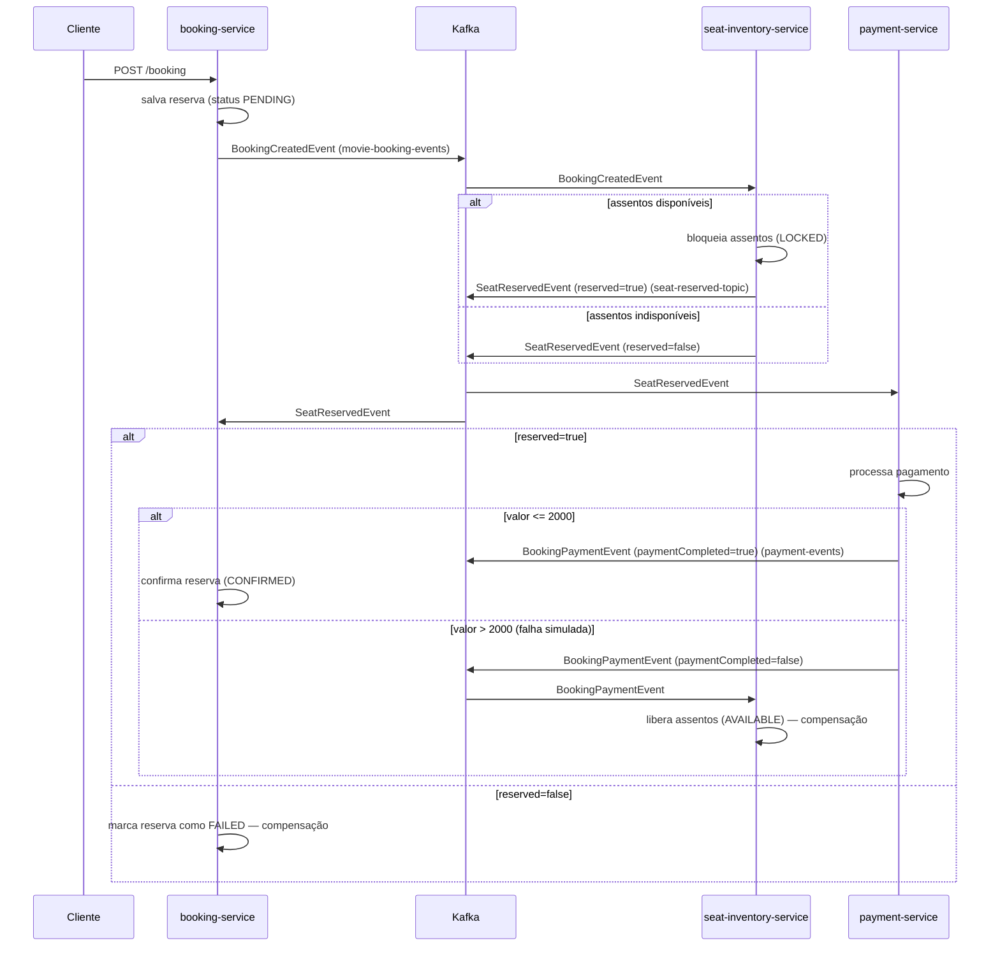

# 🎬 Saga Coreografada — Reserva de Ingressos de Cinema

Projeto de estudo que implementa o padrão **Saga Coreografada (Choreographed Saga)** em uma arquitetura de microsserviços, usando **Spring Boot**, **Apache Kafka** e **MySQL**, simulando o fluxo de reserva de ingressos de cinema (assento → pagamento → confirmação), incluindo os cenários de **compensação** quando algo dá errado.

Na saga coreografada não existe um orquestrador central: cada serviço publica e consome eventos no Kafka e decide, de forma autônoma, o que fazer a seguir (seguir em frente ou compensar/desfazer a transação anterior).

Cada serviço também é dono exclusivo do seu próprio banco de dados (**database per service**) — não há acesso direto a tabelas de outro serviço; toda comunicação entre eles acontece via eventos no Kafka.

---

## 📐 Arquitetura



### Tópicos Kafka

| Tópico | Publicado por | Consumido por | Evento |
| --- | --- | --- | --- |
| `movie-booking-events` | booking-service | seat-inventory-service | `BookingCreatedEvent` |
| `seat-reserved-topic` | seat-inventory-service | payment-service, booking-service | `SeatReservedEvent` |
| `payment-events` | payment-service | seat-inventory-service | `BookingPaymentEvent` |

### Fluxo de compensação

- **Assentos indisponíveis:** `seat-inventory-service` publica `SeatReservedEvent(reserved=false)` → `booking-service` marca a reserva como `FAILED`.
- **Falha no pagamento** (regra simulada: valor da reserva **maior que 2000**): `payment-service` publica `BookingPaymentEvent(paymentCompleted=false)` → `seat-inventory-service` libera os assentos previamente bloqueados, voltando ao status `AVAILABLE`.

---

## 🧩 Módulos do projeto

| Módulo | Descrição | Porta | Banco de dados |
| --- | --- | --- | --- |
| [`movie-booking-commons`](./movie-booking-commons) | Biblioteca compartilhada com eventos (`BookingCreatedEvent`, `SeatReservedEvent`, `BookingPaymentEvent`), DTOs (`BookingRequest`, `BookingResponse`) e constantes de configuração do Kafka. Usada como dependência pelos demais serviços. | — | — |
| [`booking-service`](./booking-service) | Recebe as solicitações de reserva, persiste a reserva (`PENDING`), publica o evento de criação e reage aos eventos de reserva de assento, confirmando (`CONFIRMED`) ou falhando (`FAILED`) a reserva. | `9191` | MySQL próprio — `booking_db` (`localhost:3306`) |
| [`seat-inventory-service`](./seat-inventory-service) | Controla o inventário de assentos por sala/sessão. Bloqueia assentos (`LOCKED`) quando uma reserva é criada e os libera (`AVAILABLE`) em caso de falha no pagamento. | `8080` (padrão) | MySQL próprio — `seat_inventory_db` (`localhost:3308`) |
| [`payment-service`](./payment-service) | Simula um gateway de pagamento. Processa o pagamento após a confirmação de assento e publica sucesso ou falha (falha simulada quando o valor é maior que `2000`). | `9393` | Sem persistência própria ainda |

---

## 🛠️ Tecnologias

- Java 25
- Spring Boot 4.0.8 (Web, Data JPA, Kafka)
- Apache Kafka (KRaft, sem Zookeeper)
- MySQL 8
- Lombok
- springdoc-openapi (Swagger UI no `booking-service`)
- Maven (multi-módulo, com o `movie-booking-commons` como dependência local)
- Docker / Docker Compose

---

## ▶️ Como executar

### Pré-requisitos

- JDK 25
- Maven 3.9+ (ou use o `mvnw` incluso em cada serviço)
- Docker e Docker Compose

### 1. Subir a infraestrutura (MySQL por serviço + Kafka)

```bash
docker compose up -d
```

Isso sobe:
- **MySQL do booking-service** em `localhost:3306` (banco `booking_db`, usuário `root`, senha `Password`)
- **MySQL do seat-inventory-service** em `localhost:3308` (banco `seat_inventory_db`, usuário `root`, senha `Password`)
- **Kafka** (modo KRaft) em `localhost:9092`

Cada serviço tem seu próprio container MySQL e seu próprio volume Docker — não existe mais um banco único compartilhado entre os serviços.

### 2. Instalar o módulo compartilhado

Antes de rodar os serviços, instale o `movie-booking-commons` no repositório Maven local, já que os demais módulos dependem dele:

```bash
cd movie-booking-commons
mvn clean install
cd ..
```

### 3. Subir os microsserviços

Em terminais separados (ou usando sua IDE), rode cada aplicação:

```bash
cd seat-inventory-service && ./mvnw spring-boot:run
cd payment-service && ./mvnw spring-boot:run
cd booking-service && ./mvnw spring-boot:run
```

> As tabelas são criadas automaticamente (`ddl-auto: update`) e o `seat-inventory-service` já carrega assentos de exemplo via `data.sql` (sessões `SHOW_101`, `SHOW_202` e `SHOW_303`).

---

## 📡 API — booking-service

Base URL: `http://localhost:9191/booking`

Documentação interativa (Swagger UI): `http://localhost:9191/swagger-ui.html`

### Criar uma reserva

```
POST /booking
Content-Type: application/json
```

```json
{
  "reservationId": "BOOK_20251104_010",
  "showId": "SHOW_101",
  "seatIds": ["A1", "A2"],
  "userId": "USER_123",
  "timestamp": "2025-11-04T20:00:00Z",
  "amount": 1500
}
```

**Resposta (200):**

```json
{
  "reservationId": "BOOK_20251104_010",
  "status": "PENDING"
}
```

O status evolui de forma assíncrona conforme a saga avança: `PENDING` → `CONFIRMED` (sucesso) ou `PENDING` → `FAILED` (falha na reserva de assento ou no pagamento).

### Consultar o status de uma reserva

```
GET /booking/{reservationId}
```

**Resposta (200):**

```json
{
  "reservationId": "BOOK_20251104_010",
  "status": "CONFIRMED"
}
```

> 💡 Para forçar o cenário de falha de pagamento (compensação), envie um `amount` maior que `2000`.

---

## 📁 Estrutura do repositório

```
saga-coreografada/
├── booking-service/            # Orquestra a reserva do ponto de vista do usuário
├── movie-booking-commons/      # Eventos, DTOs e constantes compartilhadas
├── payment-service/            # Simulação do gateway de pagamento
├── seat-inventory-service/     # Controle de inventário/bloqueio de assentos
├── docker-compose.yml          # Infraestrutura local (1 MySQL por serviço + Kafka)
└── README.md
```

---

## 📌 Observações

- Este é um projeto de estudo focado em ilustrar o padrão de **Saga Coreografada** com Kafka; não há autenticação, validações completas de negócio nem tratamento exaustivo de erros.
- O `seat-inventory-service` não define uma porta customizada no `application.yml`, portanto sobe na porta padrão do Spring Boot (`8080`).
- A regra "pagamento falha quando `amount > 2000`" é apenas uma simulação para exercitar o fluxo de compensação.
- Cada serviço com persistência tem seu próprio container MySQL e seu próprio schema (`booking_db` e `seat_inventory_db`), seguindo o padrão **database per service**. Se o `payment-service` ganhar persistência no futuro, o ideal é seguir o mesmo padrão: um MySQL dedicado (ex: `payment_db`) em vez de reaproveitar um banco existente.
- Ao trocar as portas/bancos no `docker-compose.yml`, lembre que o mapeamento de portas segue o formato `"porta_no_host:porta_no_container"` — o MySQL dentro do container sempre escuta na `3306`, então só o lado esquerdo do mapeamento deve mudar entre os serviços.